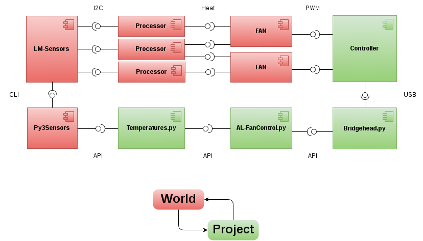

# AL-FanControl

An application-level fan control for desktop PCs
    using Linux, Python, Arduino and PWM fans.

## Architecture

AL-FanControl controls fans according to the system temperature.
The image below shows an exemplary setup of AL-FanControl
    with three processors and two fans.

The main heat sources in modern computers usually expose some sensors via I2C.
These sensors can be read using LM-Sensors via an command line interface.
Py3Sensors provides an API to Python2 and Python3 appications.
This project's `Temperatures.py` reduces Py3Sensors API to temperature sensors.
This project's main application is `AL-FanControl.py`,
    which reacts to changed temperatures with changing the fan setpoints.
To send the setpoints to the controller,
    it uses the API of the `Bridgehead.py`.
The `Bridgehead.py` uses a serial interface (USB)
    to transfer the setpoints to the controller.
The controller controls the fans
    by setting its PWM outputs according to the setpoints.
All fans dissipate heat from surrounding processors.

## Rationale

PC cooling has always been an area of constant change.
In the past,
    ever more power hungry CPUs have lead to
    sophisticated cooling techology.
In combination with more efficient CPUs
    this has enabled smaller and quieter cooling,
    in recent years.
Yet,
    desktop PCs continue to be
    loud at idle and hot under load.
This is an attempt
    at reinventing fan control.
I hope to provoke
    a change in the way we control our fans
    that I feel is long overdue.

Plugging PWM fans into mainboards is a gamble,
    because many built-in fan control do not work properly.
Often PC users are are plagued by
    unnecessary fan noise at idle,
    nervously accelerating fans under short-time load and
    high temperatures at precious hardware.
When swapping
    mainboards, fans or operating systems,
    a previously well-working setup cam misbehave.
Fan controls can be much better and reliable.

Mainboards often only provide a few fan connectors,
    usually three or four.
PC cases come in a plethora of designs
    that feature anywhere from 0 to arbitrarily many fans.
So mainboards
    are notoriously underspecified
    for complex PC builds.
Dedicated hardware
    can control
    the fans
        of a PC
    more scalable
    than mainboards.

The electric motors
    of modern PC fans
    can be regulated via the voltage applied to them.
However,
    many fans
    are not able to
    spin up
    at low voltages.
Assuming fans to be running when they actually fail to spin up
    may lead to unintended actions.
For example,
        the controller may throttle the fans excessively immediately after boot
    and
        only
        apply enough voltage
            for them to spin up,
        when
        the temperatures
            of the components to be cooled
        already exceed limits.
Exceeding temperature limits may lead to
    instability, errors and crashes
    reboots
        when there is a rescue mechanism in place
    or
    increased wear and tear
        when there isn't.
So regulating PC fans
    via voltage is inherently dangerous.
Alternatively,
    some PC fans can be controlled via a digital pulse width modulated (PWM) signal.
With PWM variants of fans costing only little more than the voltage regulated ones,
    choosing PWM fans becomes more and more viable.
Controlling PC fans
    using a digital PWM signal
    is much more reliable,
    because the fans are guaranteed to spin up even at the lowest cycle time.

FanControl is a hardware platform
    for building better fan controls.
It works around
    the often false abstraction
        of the mainboard
    and replaces it with a sane lower-level layer.
Upon this standardised lower-level operation,
    FanControl provides applications easy access to PWM fans.

This repository contains
    a complete chain of open-sourced parts
    necessary to upgrade
        a common desktop PC
        with a software-defined fan control.
These are
    an schematic
        for the neccessary electronics,
    Arduino code
        for the controller-side
    Python code
        for the host-side.

The electronic plans
    comprise
        a breadboard layout,
        electronic schematic and
        platine layout.
They are provided
        in the Fitzing format
    and
        can be be fabricated even at small volumes.

The electronic are based on an
    Atmel 32u4, which
        has hardware USB support
        and
        is fast enough to do PWM in software.
It handles
    the immediate pwm control
        and
    the fan speed sensing.

The Python code
    is structured in layers
        that can be easily replaced by alternative implementaions.
The application level code
    is free of cruft
        and
    can be extended with custom functionality.
Thermal limits and fan caracteristics
    can be defined
    via configuration files.

## Features

-   reusable
    -   Open Source
    -   Open Hardware
-   reproducable
    -   fully documented
    -   fabricatable via Fritzing
-   compact
    -   requires no 3.5"/5.25" bay
    -   fits in a small space inside the case
-   affordable
    -   about 30 € for 1 unit
-   compatible
    -   uses common USB
-   simple protocol
    -   one message to the controller follows one message to the host
-   universal
    -   up to 8 channels for complex PCs

## Design

-   stand-alone hardware that can safely operate during boot/shutdown
-   small Arduino code that only does what it needs to
-   simple protocol that can be easily implemented on the host
-   virtually direct access to PWM from the application level
-   application logic written in Python for easy reimplmentation

## Dependencies

Hardware-level

-   1 free USB port
-   1 free 12 V Molex connector
-   (preferably exclusively) PWM fans

OS-level

-   Linux
-   Python or Python3 or PyPy or PyPy3
-   lm-sensors

Python-level

-   Py3Sensors
-   PySerial

## Bill of Materials

-    6 € Arduino-clone
-   10 € printed circuit board (or a breadboard and good soldering skills)
-   14 € small electronic components

## See also

-   NZXT Grid
    -   10 fans (3-pin molex)
    -   1 channel (3-pin molex)
    -   analog
    -   15 €
    -   up to 30 W
    -   basically an amplifier for an analog fan channel on the mainboard
    -   hardwired (not software-defined)
    -   requires 4-pin molex connector for Power
    -   mounts inside the case
    -   closed source hardware (?)
    -   proprietary protocol (?)

-   [NZXT Grid+ V2](https://www.nzxt.com/product/detail/157-GRID-V2-digital-fan-controller.html)
    -   6 channels
    -   analog (4 - 12 V)
    -   30 €
    -   plugs into mainboard USB headers
    -   requires 4-pin molex connector for Power
    -   mounts inside the case
    -   closed source hardware (?)
    -   proprietary protocol (?)
    -   [CAM](https://cam.nzxt.com/)
        -   Windows (>= 7) GUI
        -   cloud-based data logging and analysis
        -   apps for mobile

-   [AquaComputer OCTO](https://shop.aquacomputer.de/product_info.php?products_id=3832)
    -   8 channels
    -   1 flow sensor input
    -   4 temperature sensor inputs
    -   74,90 €
    -   Controllable via windows-only aquasuite software
    -   Software updates are included only for 6 (!) months

-   [Speedfan](http://www.almico.com/speedfan.php)
    -   windows-only software
    -   GUI
    -   controls the fan controllers on a mainboard
